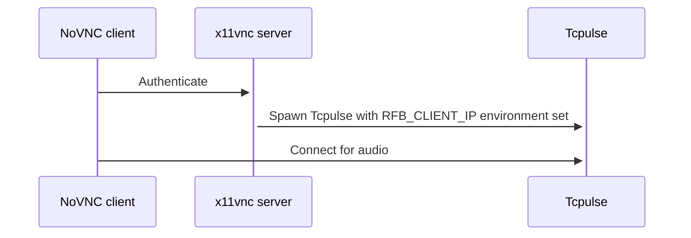

# Description
# 
NoVNC with audio - code mostly taken from NoVNC repositories - with a few custom binaries and init scripts.

Init script relies on x11vnc and the source code in this repository to work - just make and make_install the login and sound binaries. Also check the init script for the certificate that is needed by the `tcpulse` binary. The location may need to be updated. The certificate should contain both the private key and the chain.

The `tcpulse` binary calls the `gst-launch-1.0` command, so gstreamer needs to be installed too. Specifically:
```
gst-launch-1.0 -q -v alsasrc ! audio/x-raw, channels=2, rate=24000 !  voaacenc  ! mp4mux streamable=true fragment_duration=10 max-raw-audio-drift=400000  ! fdsink fd=1
```

## How To:
Copy files in /var/www to your webserver.
Run "make && make install" in the login and sound folders.
Copy init script to /etc/init.d/ and the Xorg config somewhere, edit init script with UserIDs as needed.
Copy `usr/local/bin/vnc-session-guard` to /usr/local/bin/ and `chmod 755` it - the init script starts it.
Add file containing the vnc password in `~/.vnc/vnc_password` and chmod to 600
Enjoy your VNC server with audio.

https://github.com/novnc/noVNC

## Keeping the session alive

`.xinitrc` conventionally ends in a loop that waits on the window manager, which
ties the X server's lifetime to it. If the window manager dies - or anything kills
the startx/xinit process tree - X shuts down cleanly and takes every application
and shell in the session with it. Nothing brought it back.

`vnc-session-guard` polls every 5s and restarts X, then x11vnc, when `:$DISP`
disappears. The init script launches it via `start-stop-daemon` with a pidfile.
It logs to `/var/log/vnc-session-guard.log`.

It installs to /usr/local/bin deliberately. Automated tooling that cleans up after
itself by matching process cmdlines on substrings will match a launcher living in a
scratch directory and kill the X tree with it; keeping the supervisor on a stable
path outside those directories avoids that.

Note that `stop()` kills only this display's X, x11vnc and guard. It previously ran
`pkill -U $usrid`, which killed every process the user owned - including unrelated
login shells - on any `restart`.


It works something like this:

```mermaid
sequenceDiagram
    NoVNC client->>+x11vnc server: Authenticate
    x11vnc server->>+Tcpulse: Spawn Tcpulse with RFB_CLIENT_IP environment set
    NoVNC client->>+Tcpulse: Connect for audio
```

The `tcpulse` binary tries to bind to the IP address stored in RFB_CLIENT_IP. This pretty much means that NoVNC should be running on the same host as `x11vnc` and `tcpulse`. This also means that if you want to use this with tigervnc instead of x11vnc you need to take care of setting this environment variable if you want to limit the bind address. It defaults to `0.0.0.0`.

## Client certificates

Access is controlled with TLS client certificates, on both the VNC and the audio
connection. `tcpulse` requires `TCPULSE_CLIENT_CA` to point at a CA bundle and
refuses to start without it, since that is the only thing standing between the
desktop audio and the internet. x11vnc is given the same bundle with
`-sslverify`. Both send the CA name during the handshake, so a browser holding
several certificates offers only the matching one.

To set this up, create a CA and a client certificate, and import the PKCS#12
bundle into the browser:

```
openssl req -x509 -newkey rsa:4096 -sha256 -days 3650 -nodes \
  -keyout ca.key -out ca.crt -subj "/CN=VNC client CA"
openssl req -newkey rsa:3072 -sha256 -nodes -keyout client.key -out client.csr \
  -subj "/CN=admin"
printf "keyUsage=critical,digitalSignature,keyEncipherment\nextendedKeyUsage=clientAuth\n" > client.ext
openssl x509 -req -in client.csr -CA ca.crt -CAkey ca.key -CAcreateserial \
  -days 825 -sha256 -extfile client.ext -out client.crt
openssl pkcs12 -export -inkey client.key -in client.crt -certfile ca.crt -out client.p12
```

Note when testing that TLS 1.3 reports the handshake as established before the
server validates the client certificate, so `openssl s_client` appears to succeed
even when no certificate is presented. Exchange real data to see the
`certificate required` alert.

This replaced an `/etc/allowedhosts` address list that x11vnc appended to via
`-afteraccept`. That approach granted access to an address rather than a user:
entries never expired, everyone behind the same NAT or corporate proxy inherited
access, and the file had to be world writable for the hook to append to it.


## File share and music player

Two extra pages that reuse the same client certificate as the VNC and audio
connections: a Dolphin-style file manager for the home directory, and a music
player for `~/Music`. Both live in `var/www/share/`.

### Why they need their own port

Hiawatha's `RequiredCA` - the setting that demands a client certificate - is a
property of a *binding*, not of a directory. There is no way to require a
certificate for `/share` alone. Requiring one on port 443 would require it for
the whole public site, so these pages are served from a second binding on 8443,
tied to their own virtual host. `var/www/share/index.php` and
`var/www/music/index.php` are small stubs on the public site that redirect there,
so `https://example.com/share` and `https://example.com/music` still work as
entry points.

Each app also refuses to run on any port but the certificate one, so nothing is
served even if the files end up reachable from the public site by another route.

### Setup

1. Create a CA and a client certificate (see *Client certificates* above) and
   import the PKCS#12 bundle into your browser.
2. Copy `var/www/share` and `var/www/music` into your webserver root.
3. Add the binding, toolkit and virtual host from
   `etc/hiawatha/hiawatha.conf.example` to your `hiawatha.conf`.
4. Add the `Wrap` line from `etc/hiawatha/cgi-wrapper.conf.example` to
   `/etc/hiawatha/cgi-wrapper.conf`, and make sure the CGI-wrapper binary has
   the setuid bit. Without this the pages run as the webserver user, which can
   read the home directory but cannot write to it.
5. `chown` the `share` directory to the user the wrapper switches to. The
   wrapper refuses to run CGI from a directory owned by anyone else.
6. Check with `hiawatha -k` before restarting.

### Linking them from your own index page

These pages are not part of any index, so add the links wherever your site lists
things. The restart link has to point at the certificate port explicitly, since
the page refuses to act on any other:

```php
echo "<a href='music/'>[Music]</a>";
echo "<a href='https://", explode(':', $_SERVER['HTTP_HOST'])[0], ":8443/vnc-restart.php'>[Restart VNC]</a>";
```

### Things that will bite you

- **The vhost is never matched.** A `VirtualHost` cannot claim the same
  `Hostname` as the `hostname` of the default website; the default site wins
  silently. Rename the default site's hostname - it still serves everything no
  vhost matches.
- **403 on every request.** The CGI-wrapper calls `setgroups()`, so the wrapped
  user loses its supplementary groups. If a directory on the path to the scripts
  is only traversable by the webserver's group, list that group in the `Wrap`
  entry as well.
- **Downloads of some file types return 403.** A `UrlToolkit` that denies by
  extension also matches the query string, so `?f=archive.bin` trips a
  `\.(bin|db|log)$` rule. Use a toolkit that denies dotfiles instead.
- **Created folders cannot be written to, uploads land as `rw-rw----`.** The CGI
  process may inherit a umask that strips the execute bit from `mkdir` - 0117
  here. The apps call `umask(0022)` at startup to correct this.

### Uploads

Uploads are chunked: the browser slices the file and each chunk is appended to a
`.part` file that is renamed into place at the end. This is not decoration - a
single large POST is not possible. Hiawatha buffers request bodies, and its PUT
path is capped at 2047 MB. With chunking, total size is limited by free disk
rather than by any request limit. `MaxRequestSize` and the `.user.ini` limits
only need to cover one chunk.

### Previews

Image thumbnails are produced with GD, video posters with ffmpeg (a frame a few
seconds in, to avoid a black opening frame), both cached under
`~/.cache/share-thumbs` keyed on path+mtime+size. Images, video and audio open in
a preview overlay with next/previous. Audio and video are served through an
endpoint that supports HTTP Range, without which a browser cannot seek and some
will not begin playback at all.

### Music player

Reads tags with `ffprobe`, cached under `~/.cache/share-music`. Cover art comes
from `cover.jpg`/`folder.jpg`/`front.jpg` in the folder, falling back to artwork
embedded in the first track. Play with nothing playing queues every track in the
current folder and below it, or in a folder selected in the list.

On Android, audio keeps playing when the tab is backgrounded because the page
presents a media session: metadata, artwork, position, and handlers for play,
pause, stop, next, previous and seeking. Metadata alone is not enough - without
play/pause handlers the notification has no controls and the session is treated
as inert. A web app manifest is served from `?manifest=1`, so adding it to the
home screen gives it its own task rather than a tab the system may discard.

It can also download audio from YouTube into the folder being viewed, using
`var/www/share/music/youtube.py` (which wraps `yt-dlp`). The job runs detached
and its output is polled, because a playlist takes longer than a request should
be held open. The URL is validated against a YouTube pattern before it reaches a
shell - `escapeshellarg` alone would still allow a `file://` URL or another site
to be handed to `yt-dlp`. Keep the script out of the served path, or deny it in
the toolkit as the example config does.

### Restarting VNC

`var/www/share/vnc-restart.php` restarts `/etc/init.d/vnc` from the browser. It
is deliberately on the certificate-protected vhost: the init script's `stop()`
runs `pkill -U 1000`, which ends the whole desktop session, and it needs root.
On the public site that would be an unauthenticated denial of service, and would
mean giving the webserver `sudo`.

The restart is spawned detached via `setsid sudo`. Run inline it would be killed
by its own `pkill` - the CGI process is that user - possibly leaving the service
stopped.
