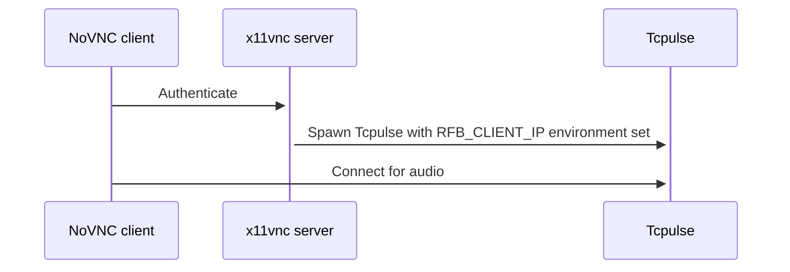

# Description
# 
NoVNC with audio - code mostly taken from NoVNC repositories - with a few custom binaries and init scripts.

Init script relies on x11vnc and the source code in this repository to work - just make and make_install the login and sound binaries. Also check the init script for the certificate that is needed by the `tcpulse` binary. The location may need to be updated. The certificate should contain both the private key and the chain.

The `tcpulse` binary calls the `gst-launch-1.0` command, so gstreamer needs to be installed too. Specifically:
```
gst-launch-1.0 -q -v alsasrc ! audio/x-raw, channels=2, rate=24000 !  voaacenc  ! mp4mux streamable=true fragment_duration=10 max-raw-audio-drift=400000  ! fdsink fd=1
```

## How To:
Copy files in /var/www to your webserver.
Run "make && make install" in the login and sound folders.
Copy init script to /etc/init.d/ and the Xorg config somewhere, edit init script with UserIDs as needed.
Add file containing the vnc password in `~/.vnc/vnc_password` and chmod to 600
Enjoy your VNC server with audio.

https://github.com/novnc/noVNC

It works something like this:

```mermaid
sequenceDiagram
    NoVNC client->>+x11vnc server: Authenticate
    x11vnc server->>+Tcpulse: Spawn Tcpulse with RFB_CLIENT_IP environment set
    NoVNC client->>+Tcpulse: Connect for audio
```

The `tcpulse` binary tries to bind to the IP address stored in RFB_CLIENT_IP. This pretty much means that NoVNC should be running on the same host as `x11vnc` and `tcpulse`. This also means that if you want to use this with tigervnc instead of x11vnc you need to take care of setting this environment variable if you want to limit the bind address. It defaults to `0.0.0.0`.

## Client certificates

Access is controlled with TLS client certificates, on both the VNC and the audio
connection. `tcpulse` requires `TCPULSE_CLIENT_CA` to point at a CA bundle and
refuses to start without it, since that is the only thing standing between the
desktop audio and the internet. x11vnc is given the same bundle with
`-sslverify`. Both send the CA name during the handshake, so a browser holding
several certificates offers only the matching one.

To set this up, create a CA and a client certificate, and import the PKCS#12
bundle into the browser:

```
openssl req -x509 -newkey rsa:4096 -sha256 -days 3650 -nodes \
  -keyout ca.key -out ca.crt -subj "/CN=VNC client CA"
openssl req -newkey rsa:3072 -sha256 -nodes -keyout client.key -out client.csr \
  -subj "/CN=admin"
printf "keyUsage=critical,digitalSignature,keyEncipherment\nextendedKeyUsage=clientAuth\n" > client.ext
openssl x509 -req -in client.csr -CA ca.crt -CAkey ca.key -CAcreateserial \
  -days 825 -sha256 -extfile client.ext -out client.crt
openssl pkcs12 -export -inkey client.key -in client.crt -certfile ca.crt -out client.p12
```

Note when testing that TLS 1.3 reports the handshake as established before the
server validates the client certificate, so `openssl s_client` appears to succeed
even when no certificate is presented. Exchange real data to see the
`certificate required` alert.

This replaced an `/etc/allowedhosts` address list that x11vnc appended to via
`-afteraccept`. That approach granted access to an address rather than a user:
entries never expired, everyone behind the same NAT or corporate proxy inherited
access, and the file had to be world writable for the hook to append to it.
