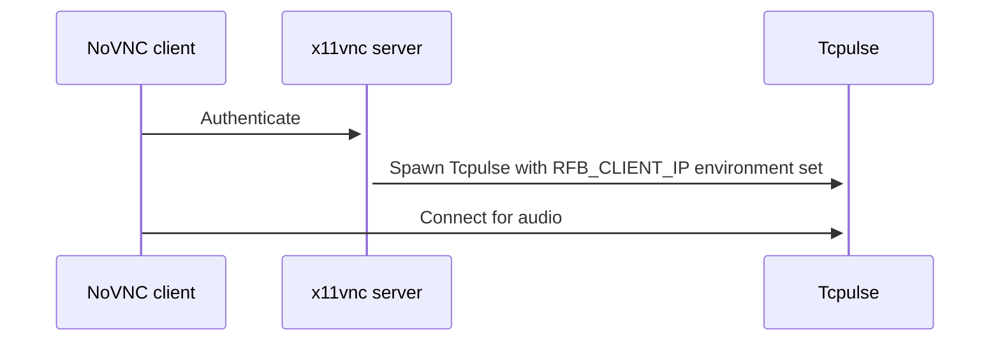

# Description
# 
NoVNC with audio - code mostly taken from NoVNC repositories - with a few custom binaries and init scripts.

Init script relies on x11vnc and the source code in this repository to work - just make and make_install the login and sound binaries. Also check the init script for the certificate that is needed by the `tcpulse` binary. The location may need to be updated. The certificate should contain both the private key and the chain.

The `tcpulse` binary calls the `gst-launch-1.0` command, so gstreamer needs to be installed too. Specifically:
```
gst-launch-1.0 -q -v alsasrc ! audio/x-raw, channels=2, rate=24000 !  voaacenc  ! mp4mux streamable=true fragment_duration=10 max-raw-audio-drift=400000  ! fdsink fd=1
```

## How To:
Copy files in /var/www to your webserver.
Run "make && make install" in the login and sound folders.
Copy init script to /etc/init.d/ and the Xorg config somewhere, edit init script with UserIDs as needed.
Add file containing the vnc password in `~/.vnc/vnc_password` and chmod to 600
Enjoy your VNC server with audio.

https://github.com/novnc/noVNC

It works something like this:


The `tcpulse` binary tries to bind to the IP address stored in RFB_CLIENT_IP. This pretty much means that NoVNC should be running on the same host as `x11vnc` and `tcpulse`. This also means that if you want to use this with tigervnc instead of x11vnc you need to take care of setting this environment variable if you want to limit the bind address. It defaults to `0.0.0.0`.
